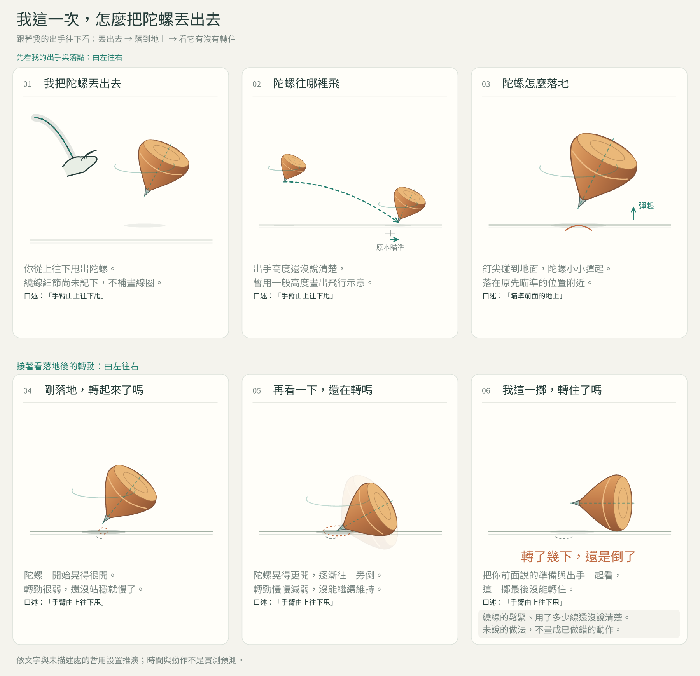
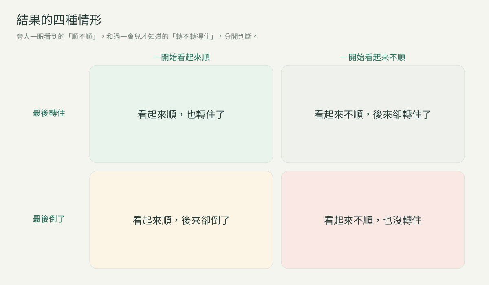
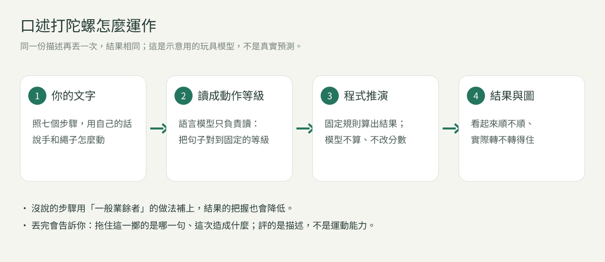
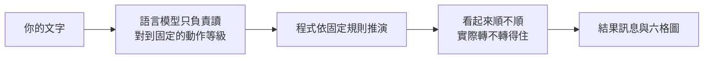

# 口述打陀螺｜學生使用說明

用文字描述你會怎麼打陀螺，Telegram 上的 bot 會依你的描述推演這一擲，再畫出過程。
你不用真的動手，也不用安裝任何程式，只需要 Telegram。

> 這是課堂研究用的原型。結果是示意用的玩具模型，不是真實打陀螺的預測。

📄 [下載 PDF 版](口述打陀螺_學生使用說明.pdf)

📊 [9/22、9/29 兩次課堂實測的整理](課堂整理.md)

---

## 一、上課前：安裝 Telegram

1. 手機到 App Store 或 Google Play 搜尋 **Telegram**，安裝並註冊；電腦版可到 [telegram.org](https://telegram.org) 下載。
2. 不需要另外安裝其他程式。

## 二、加入課堂 bot

1. 上課時用手機相機掃老師給的 **QR code**，或點老師給的連結。
2. Telegram 開啟後按 **開始**（Start）。
3. 讀完說明後按同意，就可以開始描述。

加入連結只在課堂上提供，請不要轉傳到其他地方。

## 三、怎麼描述

用 **你自己的話**，照順序一步一步說你會怎麼做；不用貼網路或 AI 的教學，那樣看不出你自己的理解。

**每一句盡量說齊四件事**

1. 用哪隻手、哪根手指
2. 做什麼動作
3. 對線尾、繩子還是陀螺
4. 做到什麼程度：多緊、幾圈、多快、朝哪裡

程度緊跟在它修飾的動作後面說；圈數直接說數字。

**七個步驟**（照這個順序想，比較不會漏）

① 線尾固定　② 起繞與排線　③ 繞線鬆緊　④ 握持準備　⑤ 站姿與瞄準　⑥ 出手姿態　⑦ 放手與收線

- 可以分好幾句慢慢說，bot 會回你「我讀到了什麼」和進度：`①✓ ②◐ ③○ …`（✓ 說齊了、◐ 說了一部分、○ 還沒說）。
- ✓ 只代表說到了，不代表做法正確。
- 讀錯了，直接打字說要改哪裡。
- 也可以用手機鍵盤的語音輸入，把口說轉成文字送出（bot 不能直接聽語音訊息）。

## 四、丟出去，看結果

**打字描述不會把陀螺丟出去。** 說完之後，單獨傳 `/throw` 才會投擲。

丟完你會收到：

1. **結果**：第一行告訴你轉住了沒有。
2. **拖住這一擲的做法**：是你哪一句、這次造成什麼。
3. **下次最值得先補的**：一個建議。
4. **口述的評定**：評的是你怎麼描述，不是運動能力；七個步驟的細節收在可展開的區塊裡。
5. **一張六格過程圖**：圖下方的按鈕可以逐格放大，或核對 bot 怎麼讀你的動作。

想改寫再試一次，傳 `/reset`；之前的紀錄會保留。同一份描述再丟一次，結果相同。

### 六格圖怎麼看

上排是出手、飛行、落地，下排是剛落地、過一會兒、最後結果。每格下方是相關的原句；如果你的某個做法拖住了這一擲，那一格會多一個說明框。

*這張是虛構的例子：只描述了手心、甩法和瞄準，其他步驟都沒說，所以 bot 用一般業餘者的做法補上，最後一格也註明「還沒說清楚」。沒說的做法不會被畫成做錯的動作。*

### 結果的四種情形

旁人一眼看到的「順不順」，和過一會兒才知道的「轉不轉得住」，是分開判斷的，所以會有看起來順卻倒了、或看起來不順卻轉住的情形。

## 五、原理

- **語言模型只負責讀。** 它把你的句子對到固定的動作等級，並且要能指出是你哪一段原文；它不計算、也不改動任何結果。
- **結果由程式算。** 固定的規則依你描述的動作推演；同一份描述、同一個場地，再丟一次結果一樣，不能靠重丟碰運氣。
- **沒說的步驟會被補上。** 用一般業餘者的做法代替，所以說得越完整，結果越貼近你的描述，bot 也越有把握。
- **評的是描述。** 評定看的是你說得多細、做法合不合適、有沒有漏講、有沒有說出目的；不是在評你的運動能力。
- **這是玩具模型。** 數字沒有經過真實校準，只用來比較不同描述之間的差別，不是轉動秒數的預測。

## 六、指令一覽

| 指令 | 用途 |
|---|---|
| `/steps` | 逐項看描述進度 |
| `/status` | 核對 bot 讀到的做法與你的原句 |
| `/throw` | 用目前的描述投擲 |
| `/frames` | 逐格看這一擲的結果 |
| `/actions` | 核對 bot 怎麼理解你的動作 |
| `/reset` | 重新開始（紀錄保留） |
| `/level` | 看場地條件 |
| `/method` | 看這個練習怎麼判讀 |
| `/help` | 重看操作方式 |
| `/export` | 取回自己的資料 |
| `/delete` | 刪除自己的資料 |

每個指令單獨傳一則。

## 七、資料與隱私

- 開始前會先請你同意；同意後，你的描述會保存作為課堂研究資料，老師可以看到。
- 隨時可以用 `/export` 取回、用 `/delete` 刪除自己的資料。
- 請在與 bot 的私人對話中練習，不要把描述貼到群組。

## 八、常見問題

**打字會不會不小心把陀螺丟出去？** 不會，只有單獨傳 `/throw` 才會投擲。

**為什麼要等一下才回覆？** 全班的描述輪流交給同一台電腦讀，bot 會告訴你前面還有幾位同學；等的時候可以繼續補充，輪到你時會一起讀。

**bot 讀錯了怎麼辦？** 直接說要改哪裡，例如「剛剛那句我是說……」；用 `/status` 可以核對。

**為什麼我說了，bot 卻說還沒說到？** 試著把四件事說齊，特別是「對什麼」和「做到什麼程度」。

## 九、前兩次課堂的整理

老師把 9/22（初版）和 9/29（第二版）兩次課堂實測整理成 [課堂整理](課堂整理.md)：兩堂課的統計、bot 常讀錯的地方、排隊為什麼塞車，以及第三版怎麼改。內容取自老師的教師頁（評分細節只留在教師端），只有全班統計和改寫過的句型，沒有任何同學的原文或帳號。
